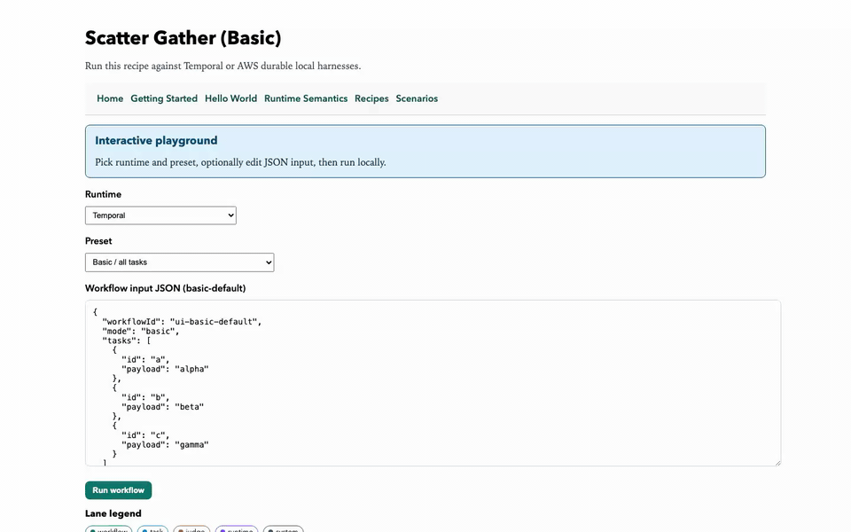
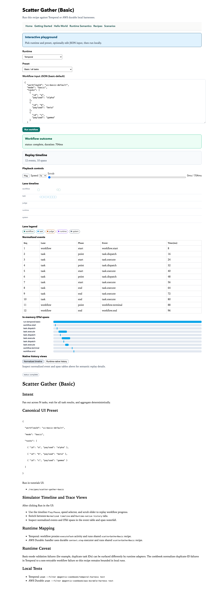
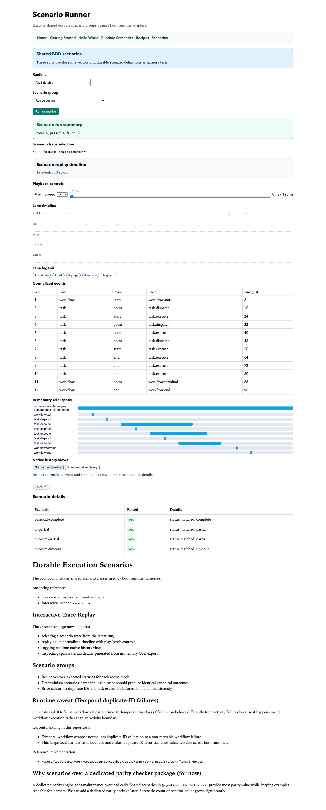

# Agentic Workflow Cookbook

[](https://codespaces.new/devdoshi/agentic-cookbook?quickstart=1)

Agentic systems need durable execution, but runtime semantics are hard to compare from docs alone.

This cookbook lets you run the same workflow recipes and scenario suites across durable execution runtimes, inspect canonical outcomes and traces, and build intuition for which runtime model fits which class of agent workflow.

No cloud credentials are required for the current demo.

## Who This Is For

- AI app and backend engineers building stateful, retry-heavy, failure-prone workflows.
- Platform engineers evaluating durable execution runtimes for agent orchestration.
- Runtime-curious teams comparing Temporal, AWS Durable Task-style execution, and future adapters such as DBOS, Cloudflare Workflows, Restate, or Rivet.
- Educators and workshop authors who want runnable examples that show determinism, replay, timeout behavior, partial completion, and task failure.

## What You Compare

The core loop is:

1. Pick a recipe, such as scatter/gather, AI completion, or quorum timeout.
2. Run it against `temporal`.
3. Run the same input against `aws-durable`.
4. Inspect the canonical outcome, normalized trace, OTel-style spans, and runtime-native history.
5. Run scenario suites that assert the same behavior across runtimes.

The point is not to hide runtime differences. The point is to make them visible, testable, and discussable.

## See Recipes And Scenarios First

[](docs/videos/demo-recipes-and-scenarios.webm)

[Open the higher-quality WebM recording](docs/videos/demo-recipes-and-scenarios.webm).

| Recipe result | Scenario suite |
| --- | --- |
|  |  |

What you will see:

- Recipes run through both `temporal` and `aws-durable`.
- Scenario suites run the same vectors against both runtimes.
- Results show completed, partial, and timeout behavior.
- Trace panels show normalized events, OTel-style spans, and runtime-native history.

## Run It

The fastest path is GitHub Codespaces:

1. Click **Open in GitHub Codespaces** above.
2. Wait for setup to finish. The demo server starts automatically.
3. Open the forwarded **5173** port when Codespaces prompts you.
4. Go straight to `/recipes/scatter-gather-basic`.
5. Click **Run recipe** with `temporal`, then switch to `aws-durable` and run it again.
6. Go to `/scenarios`, run `recipe-vectors`, and compare the runtime traces.

That is enough to see durable execution in action: fan-out tasks, deterministic results, runtime-native history, normalized trace events, and shared scenarios across both runtimes.

If the port prompt does not appear, open the **Ports** tab and open port `5173`.

## Other Ways To Run

Use the same Dev Container in:

- GitHub Codespaces: [open this repo in a Codespace](https://codespaces.new/devdoshi/agentic-cookbook?quickstart=1).
- Ona: create a project from `https://github.com/devdoshi/agentic-cookbook`; it will detect `.devcontainer/devcontainer.json`.
- VS Code Dev Containers: clone the repo, then run **Dev Containers: Reopen in Container**.
- DevPod: run `devpod up github.com/devdoshi/agentic-cookbook`.

Local fallback:

```bash
corepack enable
corepack prepare pnpm@10.5.2 --activate
pnpm install
pnpm demo
```

Then open `http://localhost:5173`.

## One-Command Checks

```bash
pnpm run test:local
pnpm run verify:devcontainer
```

`test:local` runs the Temporal and AWS durable harnesses. `verify:devcontainer` runs lint, typecheck, tests, installs Playwright Chromium, and performs a UI smoke test against both runtimes.

## What This Repo Contains

A `pnpm` + Turborepo monorepo for durable workflow recipes targeting:

- Temporal TypeScript local harness.
- AWS Durable Lambdas local harness.

## Workspace Map

- `apps/temporal-harness`: Temporal workflow + activities + tests.
- `apps/aws-durable-harness`: AWS durable handler + local runner tests.
- `apps/tutorials-web`: React Router v7 + json-render tutorials UI with interactive recipe and scenario runners.
- `packages/workflow-spec`: Shared recipe domain logic and ports.
- `packages/ai-judge-fixtures`: Deterministic fixture replay judge.
- `packages/test-kit`: Shared vectors and durable scenario suites.
- `docs`: Getting started, recipes, scenarios, and tutorials.
- `infra/pulumi`: Planned infrastructure-as-code examples.

## Recipes

- `scatterGatherBasic`
- `scatterGatherAiComplete`
- `scatterGatherQuorumTimeout`

## Durable Scenario Coverage

- Recipe vectors (expected status assertions).
- Determinism scenarios (same input, same canonical outcome).
- Error scenarios (duplicate IDs and simulated task failures).
- Scenario authoring guide: `docs/scenarios/scenario-authoring.md`.

The repo intentionally uses shared scenarios from `@agentic-cookbook/test-kit` instead of a dedicated parity-checker package for now. This keeps the educational story simple while still enforcing cross-runtime behavior through common tests.

## Commands

- `pnpm install`
- `pnpm lint`
- `pnpm typecheck`
- `pnpm test`
- `pnpm build`
- `pnpm check`
- `pnpm run test:durable`
- `pnpm run test:temporal`
- `pnpm run test:local`
- `pnpm demo`
- `pnpm --filter @agentic-cookbook/tutorials-web build && pnpm --filter @agentic-cookbook/tutorials-web start`
- `pnpm --filter @agentic-cookbook/tutorials-web videos:install`
- `pnpm run videos:record`

## Repeatable Containerized CI

- Build and run checks in a pinned container:

```bash
pnpm run ci:docker
```

This uses `Dockerfile.ci` and runs `pnpm check` inside the container.

## Runnable Durable Runtime Workspaces

The repo includes a Dev Container configuration and guide for running the
Temporal harness, AWS durable harness, shared scenarios, and tutorials UI in
GitHub Codespaces, Ona (formerly Gitpod), VS Code Dev Containers, and DevPod:

- `docs/runnable-workspaces.md`
- `.devcontainer/devcontainer.json`

## Curriculum Roadmap

- `docs/roadmap/curriculum-2026.md`

## Notes

- All root scripts delegate to `turbo run ...`.
- Package-level scripts own task logic.
- AI completeness is deterministic via fixture replay fixtures.
- Temporal tests can connect to an existing server via `TEMPORAL_ADDRESS`.
- Tutorials UI workflow/scenario APIs are wrapped by tRPC routers and invoked in SSR actions with `createCaller`.
- Simulator responses include hybrid traces: normalized events, in-memory OTel spans, and runtime-native histories.
